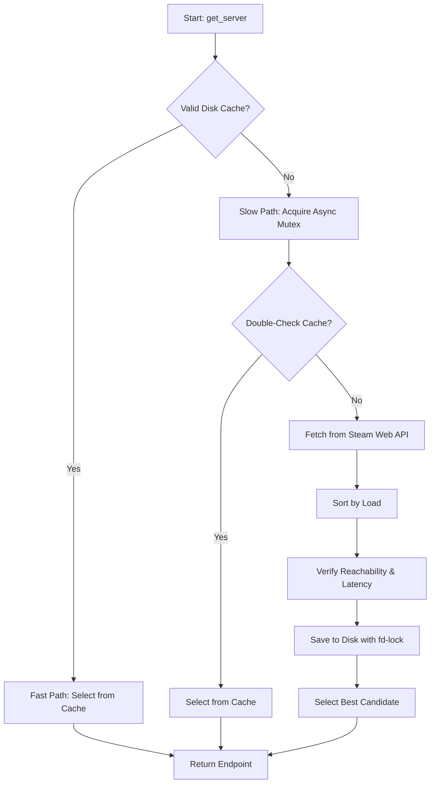

# steam-cm-provider

[](https://crates.io/crates/steam-cm-provider)
[](https://docs.rs/steam-cm-provider)
[](LICENSE)

A high-performance, resilient Steam Connection Manager (CM) discovery library for Rust.

This crate solves the problem of reliably finding and connecting to Steam's globally distributed WebSocket CM servers. It implements a multi-layered discovery strategy including Web API fetching, cross-process disk caching, and real-time connectivity validation.

## 🚀 Features

*   **Reliable Discovery**: Uses the `ISteamDirectory/GetCMListForConnect` Web API with fallback to local cache.
*   **Smart Caching Layer**:
    *   **Persistent Storage**: Caches server lists to disk (default: `~/.steam-rs/cm_servers.json`).
    *   **Cross-Process Safety**: Uses `fd-lock` (file-descriptor locks) to ensure multiple instances or processes don't corrupt the cache.
    *   **TTL Management**: Automatic cache invalidation after 7 days (Smart Server Refresh).
*   **Active Verification**:
    *   **WebSocket Handshakes**: Optionally verifies servers by performing an actual handshake.
    *   **Latency-Aware**: Sorts candidates by connection speed.
    *   **Resource Guarded**: Uses semaphores to limit concurrent network probes.
*   **Deterministic Load Balancing**: Randomly selects from the top $N$ best-performing servers to distribute load while maintaining performance.
*   **Trait-Driven Design**: 100% pluggable. Swap the HTTP client, RNG, or connectivity checker for testing or custom needs.

## 🏗 Architecture

The `get_server` flow is designed for speed and reliability:



### Fast-Path vs. Slow-Path
1.  **Fast-Path**: Checks the cache file with a shared read lock. If the cache is fresh (< 7 days), it selects a server immediately. No network overhead.
2.  **Slow-Path**: If the cache is missing or expired, it enters an async mutex to fetch from Steam API. Verification is performed concurrently using a configurable `Semaphore` to avoid socket exhaustion.

## 📦 Installation

Add this to your `Cargo.toml`:

```toml
[dependencies]
steam-cm-provider = "0.1"
```

## 🛠 Usage

### Basic Usage
The simplest way to get started is using the default provider:

```rust
use steam_cm_provider::HttpCmServerProvider;

#[tokio::main]
async fn main() -> Result<(), Box<dyn std::error::Error>> {
    let provider = HttpCmServerProvider::new_default();
    let server = provider.get_server().await?;

    println!("Selected CM: {}", server.endpoint);
    Ok(())
}
```

### Advanced Configuration
Use the `HttpCmServerProviderBuilder` to fine-tune the discovery behavior:

```rust
use std::sync::Arc;
use std::time::Duration;
use steam_cm_provider::{HttpCmServerProvider, HttpCmServerProviderBuilder};

#[tokio::main]
async fn main() -> Result<(), Box<dyn std::error::Error>> {
    let provider = HttpCmServerProvider::builder()
        .cache_path(std::path::PathBuf::from("./my_cache.json"))
        .selection_pool_size(3) // Pick from top 3 servers
        .connection_timeout(Duration::from_millis(500)) // Low latency preferred
        .max_concurrent_checks(50) // High concurrency for verification
        .build();

    let server = provider.get_server().await?;
    Ok(())
}
```

### Pluggable Traits
For unit testing or custom environments, you can implement the core traits:

```rust
use async_trait::async_trait;
use steam_cm_provider::{HttpClient, HttpResponse, CmError};

#[derive(Clone)]
struct MyClient;

#[async_trait]
impl HttpClient for MyClient {
    async fn get_with_query(&self, url: &str, _query: &[(&str, &str)]) -> Result<HttpResponse, CmError> {
        // Return mocked response or use another library like surf/reqwest
        Ok(HttpResponse { status: 200, body: b"{...}".to_vec() })
    }
}
```

## ⚙️ Configuration Parameters

| Parameter | Type | Default | Description |
| :--- | :--- | :--- | :--- |
| `cache_path` | `Option<PathBuf>` | `~/.steam-rs/...` | Persistent storage for CM lists. |
| `selection_pool_size` | `usize` | `5` | Randomly picks from the top N sorted servers. |
| `connection_timeout` | `Duration` | `3s` | Time limit for WebSocket handshake per server. |
| `max_concurrent_checks` | `usize` | `10` | Max parallelism for connectivity probes. |

## ⚠️ Error Handling

The crate uses a detailed `CmError` enum to categorize failures:
- `Network`: Failures during API requests.
- `Protocol`: Malformed JSON or unexpected API responses.
- `NoServers`: No reachable servers found after verification.
- `Io/Json`: Local file system or serialization errors.

## ⚖️ License

MIT
